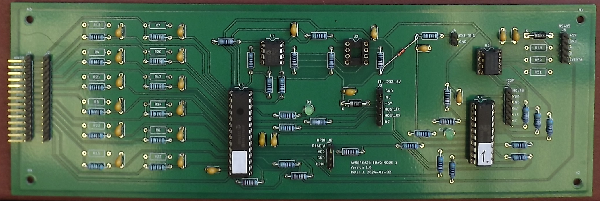
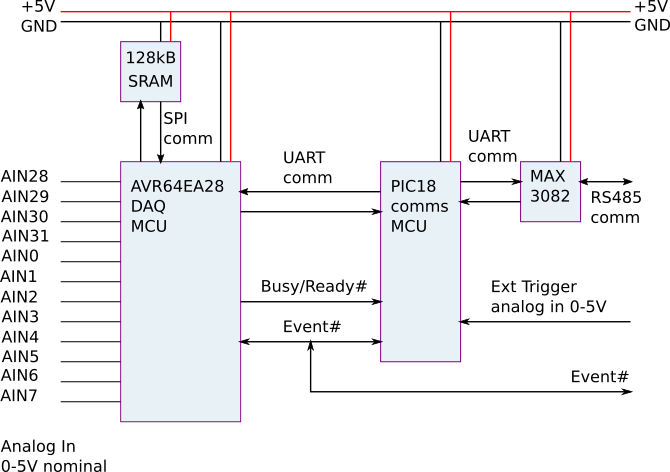

# Supervisory programs for the AVR-eDAQ-1 Data Recording Board

This directory contains Python code for supervising the AVR-eDAQ-1 board.

## Hardware

The AVR-eDAQ-1 is an embeddable data acquisition board 
based on an AVR64EA28 microcontroller for sampling up to 12 analog signals
together with a PIC18F16Q41 microcontroller that handles serial communication 
with a supervising personal computer.
The KiCAD design files for the board are available at 
[https://github.com/pajacobs-ghub/avr-edaq-1](https://github.com/pajacobs-ghub/avr-edaq-1).

The analog signals (nominally 0-5V) are provided to the J1 or J2 pin headers 
at the left side of the photograph (below).
The RS485 connection, together with power-input pins, 
is attached to the J5 pin header at the top right of the photograph.
The board is intended to be operated via text commands 
from the personal computer, with the board responding only to commands
that have been addressed to it.
Several boards can sit on the same RS485 bus and can record concurrently.

The schematic diagram of the board, roughly with the same layout,
is shown in the figure below.
The two principal components are the AVR64EA28-I/SP, called the DAQ-MCU,
and the PIC18F16Q41-I/P which is called the COMMS-MCU.
This arrangement enables the DAQ-MCU to be fully committed to regular 
sampling of the analog signals while the COMMS-MCU remains responsive
to the supervisory computer's commands. 

To the left, the analog input signals at pin headers J1 and J2 
are labelled AIN28 .. AIN7 
so that they correspond to the names of the AVR64EA28 pins.
Up to 12 single-ended signals can be attached, or 6 differential signals,
or any intermediate combination that you might like to specify.
With the simple RC filter on each signal, as shown in the photo above,
the nominal input range is 0-5V.
Adding a second resistor to form a voltage divider for each signal 
allows for higher input voltages.
The 5V and 0V power rails are also available at the same analog-in header.
These may be a convenient power source for attached sensors, however,
note that there is a Schottky diode in the power rail so the actual 
voltage getting to the sensors will be a little less than the supply
arriving at the eDAQ board.

While DAQ-MCU is sampling, the sampled data are stored locally 
on the SRAM chip, which is used as a circular buffer.
When sampling for an indefinite time, the oldest data in the chip 
are overwritten with the most recent data.
The trigger for a recording event may be sourced from one of the 
analog input signals passing a threshold level, 
by an external trigger signal passing a threshold level,
or by another board pulling the Event# signal low. 

Pin header J5, at the top right of the board, is used to provide 5V power 
and access to the RS485 bus.  It also provides access to the common Event# signal
so that the recording on several node boards can be synchronized.
The pins are:

1. 5V
2. GND
3. RS485 A
4. RS485 B
5. Event#

The COMMS-MCU accepts commands from the RS485 port and always responds.
Some commands may be passed to the DAQ-MCU for configuration, 
start of recording, and for accessing the data stored in the SRAM chip
from a previous recording event.
There is also a Busy signal, asserted by the DAQ-MCU 
while it is making a recording.
The COMMS-MCU can monitor this signal and report its value
to the supervisory PC.

The Event# signal is a common signal that can be asserted (pulled low) 
by either the DAQ-MCU, the COMMS-MCU, or an external device.
This signal going low heralds the end of the recording process.
Note that, following the Event# signal going low, the recording 
continues for a number of samples before actually stopping.
Once sampling has stopped, the DAQ-MCU becomes idle and no longer asserts
the Busy signal.

Although not shown in the figure, the COMMS-MCU can pull the DAQ-MCU's
reset pin low to force a hard reset.
This may be handy if a recording has started and there is no prospect of
and Event# signal being asserted.

The external trigger signal is fed to the PIC18's comparator via a 
simple RC filter.
The nominal input range is 0-5V but the diode between the 1k input resistor 
and the 5V power rail (and soldered diagonally in the photograph)
provides some overvoltage protection.

The COMMS-MCU is connected to the connected to the RS485 bus via a MAX3082
half-duplex level shifter.
This allows several boards (a.k.a. nodes) to be attached concurrently to the supervisory PC
and should allow reliable communication over reasonably long wires.
The serial settings are speed of 115200 baud, 8-bit data, no parity and 1 stop bit.
The supervisory computer acts as the master and each node board responds
only when a command message is directed to it.

If you wish to use just a single board and not communicate with it via
the RS485 bus, you can remove the COMMS-MCU and MAX3082 buffer chip,
and connect the DAQ-MCU to a supervisory PC via an FTDI TTL-232-5V cable
attached to pin header J3.
The AVR serial port is expecting settings of 230400 baud, 
8N1 and no flow control.
The AVR firmware also expects a `\r` (carriage-return) character to mark
the end of line at input.
This is different to the COMMS-MCU expectations on the RS485 serial bus,
as described above.

## Firmware

The source code for the firmware running on the DAQ-MCU in written in C and
can be found at [https://github.com/pajacobs-ghub/AVR64EA28-DAQ-MCU-firmware](https://github.com/pajacobs-ghub/AVR64EA28-DAQ-MCU-firmware)
The on-board firmware may be updated via the UPDI header J6.
We have been building the firmware with the free version of Microchip's
XC8 compiler (v2.46) and programming the microcontroller with a PICkit5.

The code for the COMMS-MCU at [https://github.com/pajacobs-ghub/pic18f16q41-COMMS-MCU-firmware](https://github.com/pajacobs-ghub/pic18f16q41-COMMS-MCU-firmware)
The on-board firmware may be updated via the ICSP header J7.

The firmware is each microcontroller runs a simple command interpreter 
that accepts incoming commands as a line of text.
Each interpreter acts upon any incoming command and provides a single-line response.
The PC sends commands (wrapped as messages on the RS485 bus) to the COMMS-MCU, 
which should always respond promptly.
To get commands in to the DAQ-MCU, there is a "pass-through" command 
in the COMMS-MCU's interpreter.

## Python module

The interactions with the COMMS-MCU and DAQ-MCU have been encoded into 
the Python module rs485_edaq.py in this repository.
It wraps the layers

- RS485 messages
- COMMS-MCU commands and higher-level functions
- DAQ-MCU commands and higher-level functions

with classes and methods so that it is easy to script the interaction 
with several boards.
To build your own Python script, it may be best to brows the examples 
in this repository and adapt the closest one to your intended application.
To see the details of the underlying messages and commands, read on.

## RS485 messages

Command messages sent by the supervising PC to a node's COMMS-MCU are of the form

`/cXXXXXXX!\n`

and responses from the node's COMMS-MCU are of the form

`/0XXXXXXX#\n`

where 

- `/` is the slash character, to indicate start of message
- `!` end character for command message
- `#` end character for response message
- `\n` is the new-line character
- `c` is a single-character identifier for the node board, and
- `XXXXXXX` is the rest of the command or response message.

Each board has a unique identifier and will discard all messages without that id.
It will respond only if it receives a complete message with correct id.
The supervising PC uses `0` as its id.
Note that this is the ASCII character, not the numerical value (NULL character).
We have started identifying the boards with the digits `1` to `9` and
intend to use the letters `a` to `z` and `A` to `Z`, as needed.

It is expected that most applications will be written as Python scripts 
that call the high-level functions in this repository and the user will
not need to write and read the RS485 messages directly.
However, for debugging and learning about the system, 
it may be useful to be able to formulate and send messages
to a node via a serial terminal.
When using a serial terminal to send messages to a node, 
use the key-combination `Control-J` rather then the `Enter` key 
to send that new-line character. 

### COMMS-MCU commands

Once the start and end characters of the command message are stripped,
the commands to the COMMS-MCU are of the form of a single character 
usually followed by any needed parameters as space-separated integers.
An exception is the pass-through command.

| Command | Meaning |
|---------|:--------|
| v       | Report version string. | 
| t       | Software trigger, assert Event# line low. |
| z       | Release Event# line. |
| Q       | Query the status signals, Event# and Ready/Busy#. |
| F       | Flush the RX2 buffer for incoming text from the DAQ-MCU. |
| R       | Restart the DAQ-MCU. |
| L i     | Turn the LED on (i=1) or off (i=0). |
| a       | Report the ADC value for the analog signal on the comparator input. |
| e level slope | Enable the comparator 0 < level < 255, slope is 0 or 1. |
| d       | Disable comparator and release Event# line |
| w level flag | Set VREF output, 0 < level < 255, flag=1 for on, 0 for off. |
| Xxxxxxxx | Pass command xxxxxxx through to DAQ-MCU. | 

For example, to get the version string of the COMMS-MCU on node `1`,
issue the command

`/1v!\n`

### DAQ-MCU commands

Commands passed through to the DAQ-MCU are of the form 
of a single character followed by any needed parameters 
as space-separated integers.

| Command | Meaning |
|---------|:--------|
| v       | Report version string. |
| n       | Report number of (virtual) registers. |
| Q       | Set the reporting mode to allow multi-line responses. Only useful for interaction via a TTL-232-5V cable. |
| q       | Set the reporting mode to single-line responses. Default for interaction via the RS485 bus. |
| p       | Report all register values.  Should not be used via the RS485 bus. |
| r i     | Report the value of register i. |
| s i j   | Set register i to value j. |
| R       | Restore register values from EEPROM. |
| S       | Save register values to EEPROM. |
| F       | Set the register values to those values hard-coded into the firmware. (Factory reset, so to speak.) |
| g       | Start the sampling process.  What happens next depends on the register settings and external signals. |
| G       | Start the sampling process and report values.  Should not use via the RS485 bus. |
| k       | Report the value of flag did_not_keep_up_during_sampling. |
| I       | Sample channels once and report values. |
| P i     | Report values for sample set i.  i=0 for oldest sample set. |
| M i     | Report the content of 32 bytes of SRAM memory from byte address i. |
| a       | Report byte address of oldest data in SRAM. |
| b       | Report size of a sample set in bytes. |
| m       | Report max number of sample sets in SRAM. |
| T       | Report total size of SRAM in bytes. |
| N       | Report total number of 32-byte pages in SRAM. |
| z       | Release Event# line. |
| h or ?  | Report the help text. Should not be used via the RS485 bus. |

For example, to get the version string of the DAQ-MCU on node `1`,
issue the command

`/1Xv!\n`

### Configuration registers of the DAQ-MCU

The process of making a recording is controlled by the content of the 
configuraton (virtual) registers in the DAQ-MCU.
These are an array of 16-bit numbers that may be set or read via command.

| Index | Default | Meaning |
|-------|---------|:--------|
| 0     | 1250    | Sample period in timer ticks. Each tick is 0.8 microseconds. |
| 1     | 6       | Number of channels to sample. |
| 2     | 128     | Number of samples in record after trigger event. |
| 3     | 0       | Trigger mode.  0=immediate, 1=internal, 2=external (via Event# signal) |
| 4     | 0       | Channel for internal trigger, if used. |
| 5     | 100     | Internal trigger level as an 11-bit count, 0-2047 |
| 6     | 1       | Internal trigger slope. 0=sample-goes-below-level, 1=sample-goes-above-level. |
| 7     | 0       | PGA flag for all channels.  0=direct, 1=via_PGA. |
| 8     | 0       | PGA gain. 0=1X, 1=2X, 2=4X, 3=8X, 4=16X. |
| 9     | 0       | V_REF selection. 0=1.024V, 1=2.048V, 3=4.096V |
| 10    | 28      | Pin selection for CH0+. (AIN28) |
| 11    | 29      | Pin selection for CH0-. (AIN29) |
| 12    | 30      | Pin selection for CH1+. (AIN30) |
| 13    | 31      | Pin selection for CH1-. (AIN31) |
| 14    | 0       | Pin selection for CH2+. (AIN0)  |
| 15    | 1       | Pin selection for CH2-. (AIN1)  |
| 16    | 2       | Pin selection for CH3+. (AIN2)  |
| 17    | 3       | Pin selection for CH3-. (AIN3)  |
| 18    | 4       | Pin selection for CH4+. (AIN4)  |
| 19    | 5       | Pin selection for CH4-. (AIN5)  |
| 20    | 6       | Pin selection for CH5+. (AIN6)  |
| 21    | 7       | Pin selection for CH5-. (AIN7)  |
| 22    | 2       | Pin selection for CH6+. (AIN2)  |
| 23    | 48      | Pin selection for CH6-. (GND)   |
| 24    | 3       | Pin selection for CH7+. (AIN3)  |
| 25    | 48      | Pin selection for CH7-. (GND)   |
| 26    | 4       | Pin selection for CH8+. (AIN4)  |
| 27    | 48      | Pin selection for CH8-. (GND)   |
| 28    | 5       | Pin selection for CH9+. (AIN5)  |
| 29    | 48      | Pin selection for CH9-. (GND)   |
| 30    | 6       | Pin selection for CH10+. (AIN6) |
| 31    | 48      | Pin selection for CH10-. (GND)  |
| 32    | 7       | Pin selection for CH11+. (AIN7) |
| 33    | 48      | Pin selection for CH11-. (GND)  |
| 34    | 0       | Number of samples to be taken in burst-sampling mode. (NBURST) |

Note that, by default, the first 6 channels are configured for differential input
with pairs of adjacent pins on analog signal headers J1 and J2.

Mostly, you don't need worry too much about remembering the particular 
integer values for channel selection (for example) because the Python module
provides easier-to-remember symbolic names for the integer values.

When the ADC is operated in single-sample mode (NBURST=0), 
the result is a signed integer in the range -2048 .. +2047.
When NBURST is set nonzero, the ADC result is scaled to use the full
16-bit range -32768 .. 32767.
