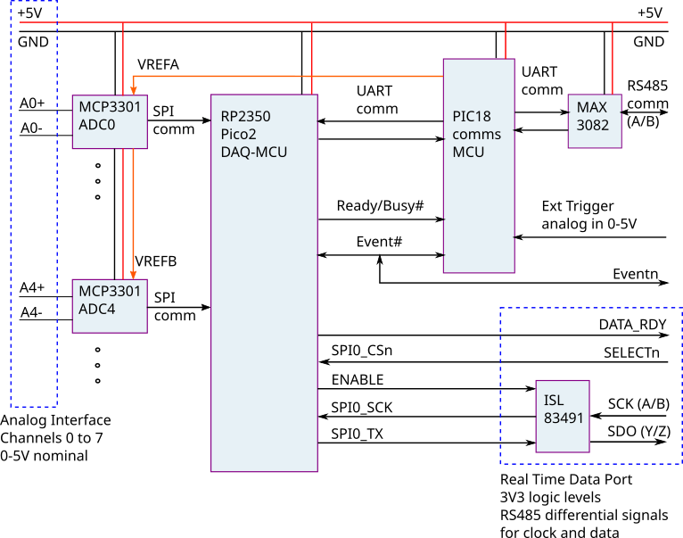

# Supervisory programs for the Pico2+MCP3301 Data Recording Board

This directory contains example Python code for supervising the Pico2+MCP3301 board.

## Hardware Description

The Pico2+MCP3301 is an embeddable data acquisition board
for recording transient events in low-voltage analog signals. 
It is based on an RP2350 microcontroller (on a Pico2 board) 
driving eight MCP3301 analog-to-digital converter chips.
A PIC18F26Q71 microcontroller acts as board manager and 
handles serial communication with a supervising personal computer,
over a multidrop RS485 bus.

The analog signals (nominally 0-5V) are interfaced 
to the J8 through J11 pin headers at the left side of the photograph (below).
Each converter accepts a differential signal and converts it to a 13-bit signed digital value at a maximum rate of 50kHz.
We might push this to 100kHz with revised firmware.
Note that sampling is synchronous across all 8 converters.

The RS485 connection, together with power-input pins, 
is attached to the J5 pin header at the bottom right of the photograph.
The board is intended to be operated via text commands from the personal computer, 
with the board responding only to commands that have been addressed to it.
Several boards can sit on the same RS485 bus and can record concurrently.
Synchronization across boards is provided by the Event# signal.

### The recording process

The schematic diagram of the board is shown in the figure below.
The two principal components are the RP2350 microcontroller
(which we call the DAQ-MCU) on the Pico2 board,
and the PIC18F26Q71-I/P, which we call the COMMS-MCU.
This arrangement enables the DAQ-MCU to be fully committed to regular 
sampling of the analog signals while the COMMS-MCU remains responsive
to the supervisory computer's commands. 

To the left, the analog input signals (at pin headers J8 through J11) 
are labelled A0+,A0-, ... A4+,A4-, ... A7+,A7- to indicate that they
are differential.
If you have a single-ended signal, 
just connect ground to the corresponding Vx- pin.
The reference voltages (VREFA and VREFB) provided by the PIC18 COMMS-MCU
to the data converters may be set within the range 400mV to 4096mV.
 
The 5V and 0V power rails are also available at the same analog-input headers.
These may be a convenient power source for attached sensors, however,
note that there is a Schottky diode in the power rail so the actual 
voltage getting to the sensors will be a little less than the +5V supply
arriving at the eDAQ board.

While DAQ-MCU is sampling, the sampled data are stored locally 
on the RP2350 MCU, in a 256kB circular buffer within SRAM.
When sampling for an indefinite time, the oldest data in the chip 
are overwritten with the most recent data.
The trigger for a recording event may be sourced from one of the 
analog input signals passing a threshold level, 
by an external trigger signal passing a threshold level,
or by another board pulling the Event# signal low. 

The Event# signal is a common signal that can be asserted (pulled low) 
by either the DAQ-MCU, the COMMS-MCU, or an external device.
This signal going low heralds "the event" and also the end of the recording process.
Note that, following the Event# signal going low, the recording 
continues for a fixed number of samples before actually stopping.
Once sampling has stopped, the DAQ-MCU becomes idle and no longer asserts
the Busy# signal.

The stored data can be later retrieved via the serial communications interface.
There are commands for retrieving individual sample sets or pages of memory.
A layer of Python code that automates the interaction via RS485 messages
reduces this process to a small number of function calls.

### Communications Interface

Pin header J5, at the bottom right of the board photo 
(but top right of the schematic), 
is used to provide 5V power and access to the RS485 bus.
It also provides access to the common Event# signal
so that the recording on several recording boards can be synchronized.
The pins are:

1. 5V
2. GND
3. RS485 A
4. RS485 B
5. Event#

The COMMS-MCU accepts commands from the RS485 port and always responds.
Some commands may be passed to the DAQ-MCU for configuration, 
start of recording, and for accessing the data stored in the SRAM chip
from a previous recording event.
There is also a Busy signal, asserted by the DAQ-MCU 
while it is making a recording.
The COMMS-MCU can monitor this signal and report its value
to the supervisory PC.

Although not shown in the schematic figure, 
the COMMS-MCU can pull the DAQ-MCU's reset pin low to force a hard reset.
This may be handy if a recording has started and there is no prospect of
and Event# signal being asserted.

The external (analog) trigger signal is fed to the PIC18's comparator 
via a simple RC filter.
The nominal input range is 0-5V but the diode between the 1k input resistor 
and the 5V power rail provides some overvoltage protection.

The COMMS-MCU is connected to the connected to the RS485 bus 
via a MAX3082 half-duplex level shifter.
This allows several boards (a.k.a. nodes) to be attached concurrently 
to the supervisory PC
and should allow reliable communication over reasonably long wires.
The serial settings are speed of 115200 baud, 8-bit data, no parity and 1 stop bit.
The supervisory computer acts as the master on the RS485 bus
and each node board responds only when a command message is directed to it.
The identity of each node is a single ASCII character and 
is programmed into the firmware on the COMMS-MCU.

### Analog-Front-End Management Interface

Headers J1 and J3, at the top right of the photograph, provide access to
4 GPIO pins of the PIC18 MCU, along with SPI and I2C communications ports.
The GPIO pins may be used for digital input or output, 
or may be used to sense analog voltage levels.
Commands sent via RS485 messages control this interface.

### Real-Time Data Port

Connector J7, at the bottom of the photograph and bottom-right of the schematic diagram, is used to make digitized samples available to another computer during
the sampling process.
The interface is essentially SPI combined with RS485 differential signalling
for the clock and data.
A DATA_RDY signal goes high when new data is available for collection.
The external computer may then select the RTDP and clock out the set of sampled
data as a 8 16-bit signed values.
Once collected, the DATA_DRY signal is lowered and a new set of values is 
posted when next available.
If, after a time-out period, the external computer has not collected the data,
the DATA_RDY signal is lowered anyway, and the offering cancelled.
New data will be posted as soon as a new sample has been collected 
from the MCP3301 data converters. 

## Firmware

The source code for the firmware running on the DAQ-MCU in written in C and
can be found at [https://github.com/pajacobs-ghub/pico2-daq-mcu-mcp3301](https://github.com/pajacobs-ghub/pico2-daq-mcu-mcp3301)
The on-board firmware may be updated as a `.uf2` file,
via the USB micro-B commector on the Pico2.
We have been building the firmware with the C/C++ development kit 
[https://github.com/raspberrypi/pico-sdk](https://github.com/raspberrypi/pico-sdk)

The code for the COMMS-MCU at [https://github.com/pajacobs-ghub/pic18f26q71-comms-4-mcu](https://github.com/pajacobs-ghub/pic18f26q71-comms-4-mcu)
The on-board firmware may be updated via the ICSP header J4.
We have been building the firmware with the free version of Microchip's
XC8 compiler (v3.10) and programming the microcontroller with a PICkit4.

The firmware is each microcontroller runs a simple command interpreter 
that accepts incoming commands as a line of text.
The command-interpreter acts upon any (relevant) incoming command 
and provides a single-line response.
The PC sends commands (wrapped as messages on the RS485 bus) to the COMMS-MCU, 
which should always respond promptly.
To get commands in to the DAQ-MCU, there is a "pass-through" command 
in the COMMS-MCU's interpreter.

## RS485 messages

Command messages sent by the supervising PC to a node's COMMS-MCU are of the form

`/cXXXXXXX!\n`

and responses from the node's COMMS-MCU are of the form

`/0XXXXXXX#\n`

where 

- `/` is the slash character, to indicate start of message
- `!` end character for command message
- `#` end character for response message
- `\n` is the new-line character
- `c` is a single-character identifier for the node board, and
- `XXXXXXX` is the rest of the command or response message.

Each board has a unique identifier and will discard all messages without that id.
It will respond only if it receives a complete message with correct id.
The supervising PC uses `0` as its id.
Note that this is the ASCII character, not the numerical value (NULL character).
We have started identifying the boards with the digits `1` to `9` and
intend to use the letters `a` to `z` and `A` to `Z`, as needed.

It is expected that most applications will be written as Python scripts 
that call the high-level functions in this repository and the user will
not need to write and read the RS485 messages directly.
However, for debugging and learning about the system, 
it may be useful to be able to formulate and send messages
to a node via a serial terminal.
When using a serial terminal to send messages to a node, 
use the key-combination `Control-J` rather then the `Enter` key 
to send that new-line character. 

### COMMS-MCU commands

TODO: revise for COMMS-4

Once the start and end characters of the command message are stripped,
the commands to the COMMS-MCU are of the form of a single character 
usually followed by any needed parameters as space-separated integers.
An exception is the pass-through command.

| Command | Meaning |
|---------|:--------|
| v       | Report version string. | 
| t       | Software trigger, assert Event# line low. |
| z       | Release Event# line. |
| Q       | Query the status signals, Event# and Ready/Busy#. |
| F       | Flush the RX2 buffer for incoming text from the DAQ-MCU. |
| R       | Restart the DAQ-MCU. |
| L i     | Turn the LED on (i=1) or off (i=0). |
| a       | Report the ADC value for the analog signal on the comparator input. |
| e level slope | Enable the comparator 0 < level < 255, slope is 0 or 1. |
| d       | Disable comparator and release Event# line |
| w level flag | Set VREF output, 0 < level < 255, flag=1 for on, 0 for off. |
| Xxxxxxxx | Pass command xxxxxxx through to DAQ-MCU. | 

For example, to get the version string of the COMMS-MCU on node `1`,
issue the command

`/1v!\n`

### DAQ-MCU commands

TODO: Revise for Pico2

Commands passed through to the DAQ-MCU are of the form 
of a single character followed by any needed parameters 
as space-separated integers.

| Command | Meaning |
|---------|:--------|
| v       | Report version string. |
| n       | Report number of (virtual) registers. |
| Q       | Set the reporting mode to allow multi-line responses. Only useful for interaction via a TTL-232-5V cable. |
| q       | Set the reporting mode to single-line responses. Default for interaction via the RS485 bus. |
| p       | Report all register values.  Should not be used via the RS485 bus. |
| r i     | Report the value of register i. |
| s i j   | Set register i to value j. |
| R       | Restore register values from EEPROM. |
| S       | Save register values to EEPROM. |
| F       | Set the register values to those values hard-coded into the firmware. (Factory reset, so to speak.) |
| g       | Start the sampling process.  What happens next depends on the register settings and external signals. |
| G       | Start the sampling process and report values.  Should not use via the RS485 bus. |
| k       | Report the value of flag did_not_keep_up_during_sampling. |
| I       | Sample channels once and report values. |
| P i     | Report values for sample set i.  i=0 for oldest sample set. |
| M i     | Report the content of 32 bytes of SRAM memory from byte address i. |
| a       | Report byte address of oldest data in SRAM. |
| b       | Report size of a sample set in bytes. |
| m       | Report max number of sample sets in SRAM. |
| T       | Report total size of SRAM in bytes. |
| N       | Report total number of 32-byte pages in SRAM. |
| z       | Release Event# line. |
| h or ?  | Report the help text. Should not be used via the RS485 bus. |

For example, to get the version string of the DAQ-MCU on node `1`,
issue the command

`/1Xv!\n`

### Configuration registers of the DAQ-MCU

The process of making a recording is controlled by the content of the 
configuraton (virtual) registers in the DAQ-MCU.
These are an array of 32-bit numbers that may be set or read via command.

| Index | Default | Meaning |
|-------|---------|:--------|
| 0     | 1250    | Sample period in microseconds. |
| 1     | 8       | Number of channels to sample. Best to choose 8, 4, 2 or 1. |
| 2     | 128     | Number of samples in record after trigger event. |
| 3     | 0       | Trigger mode.  0=immediate, 1=internal, 2=external (via Event# signal) |
| 4     | 0       | Channel for internal trigger, if used. |
| 5     | 100     | Internal trigger level as an 11-bit count, 0-2047 |
| 6     | 1       | Internal trigger slope. 0=sample-goes-below-level, 1=sample-goes-above-level. |

## Python module

The interactions with the COMMS-MCU and DAQ-MCU have been encoded into 
the Python modules in the adjacent directories.
The Python code wraps the three layers

- RS485 messages (`../comms_mcu/rs485.py`)
- COMMS-MCU commands and higher-level functions (`../comms_mcu/pic18f26q71_comms_4.py`)
- DAQ-MCU commands and higher-level functions (`../daq_mcu/pico2_daq_mcu_mcp3301.py`)

with classes and methods so that it is easy to script the interaction 
with several boards.
To build your own Python script, it may be best to browse the examples 
in this repository and adapt the closest one to your intended application.
To see the details of the underlying messages and commands, read on.
